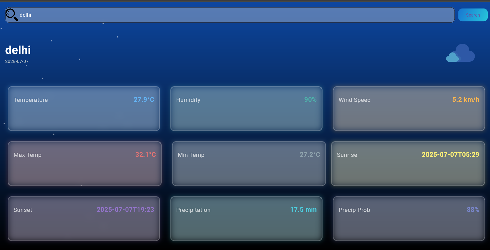

<h1 align="center">
  ☁️ Flutter Weather App
</h1>

<p align="center">
  
  
  
</p>

<h3 align="center">
  Real-time Weather Forecasts • Beautiful UI • Powered by OpenWeatherMap
</h3>

<p align="center">
  
</p>

---

## ☀️ About the App

> "Know your weather, anywhere and anytime."

This sleek and modern **Flutter Weather App** displays real-time weather updates with clean UI components and smooth layout transitions.

### 🔍 What it offers:

- 🌤️ Current temperature & weather condition
- 📍 Location-based weather info
- 🔁 Refresh on-demand
- 🎨 Animated weather-themed UI

---

## 📸 UI Preview

<p align="center">
  
  
  
</p>

---

## 🚀 Features

| Feature                    | Description                                              |
|----------------------------|----------------------------------------------------------|
| 📍 Location Access         | Gets user's current location via GPS                    |
| ☁️ Real-time Weather Data  | Uses OpenWeatherMap API for instant updates              |
| 💧 Humidity & Wind Display | Extra details beyond just temperature                   |
| 🔄 Pull-to-Refresh         | Allows users to manually update data                    |
| 🎨 Animated UI             | Custom gradient backgrounds and animated icons          |

---

## 🧰 Tech Stack

| Tech             | Role                                  |
|------------------|---------------------------------------|
| `Flutter`        | Cross-platform framework              |
| `Dart`           | Programming language                  |
| `OpenWeatherMap` | Weather data API                      |
| `http`           | API call integration                  |
| `Geolocator`     | Location-based services               |
| `Material Design`| UI structure                          |

---

## 🛠 How to Run Locally

```bash
git clone https://github.com/Adarsh-Kumar6534/flutter-weather-hub.git
cd flutter-weather-hub
flutter pub get
flutter run
